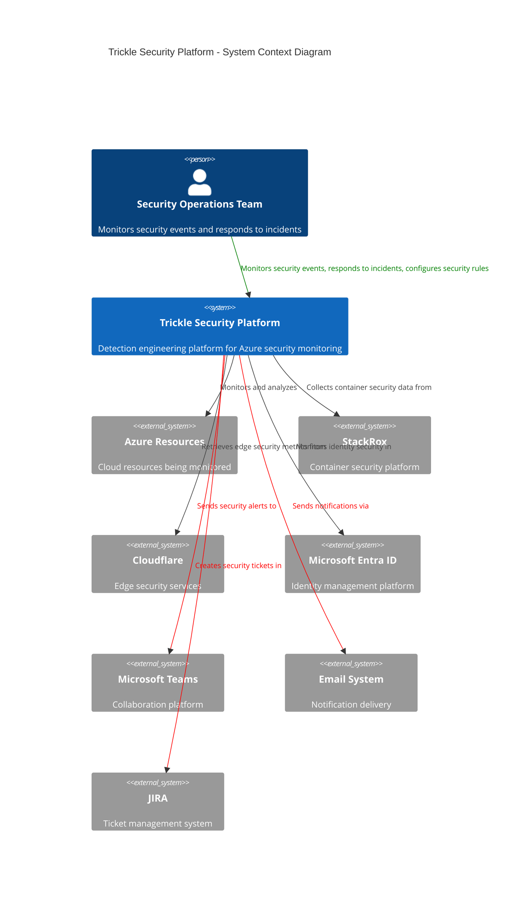

```mermaid
C4Context
  title Trickle Security Platform - System Context Diagram
  
  Person(secOps, "Security Operations Team", "Monitors security events and responds to incidents")
  
  System(trickle, "Trickle Security Platform", "Detection engineering platform for Azure security monitoring")
  
  System_Ext(azureResources, "Azure Resources", "Cloud resources being monitored")
  System_Ext(stackRox, "StackRox", "Container security platform")
  System_Ext(cloudflare, "Cloudflare", "Edge security services")
  System_Ext(entraID, "Microsoft Entra ID", "Identity management platform")
  
  System_Ext(teams, "Microsoft Teams", "Collaboration platform")
  System_Ext(email, "Email System", "Notification delivery")
  System_Ext(jira, "JIRA", "Ticket management system")
  
  Rel(secOps, trickle, "Monitors security events, responds to incidents, configures security rules")
  
  Rel(trickle, azureResources, "Monitors and analyzes")
  Rel(trickle, stackRox, "Collects container security data from")
  Rel(trickle, cloudflare, "Retrieves edge security metrics from")
  Rel(trickle, entraID, "Monitors identity security in")
  
  Rel(trickle, teams, "Sends security alerts to")
  Rel(trickle, email, "Sends notifications via")
  Rel(trickle, jira, "Creates security tickets in")
  
  UpdateRelStyle(secOps, trickle, $textColor="green", $lineColor="green")
  UpdateRelStyle(trickle, teams, $textColor="red", $lineColor="red")
  UpdateRelStyle(trickle, email, $textColor="red", $lineColor="red")
  UpdateRelStyle(trickle, jira, $textColor="red", $lineColor="red")
```