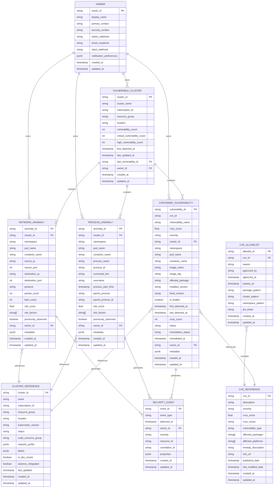

```mermaid
erDiagram
    SECURITY_EVENT {
        string event_id PK
        string event_type
        timestamp detected_at
        string owner_id FK
        string severity
        string resource_id
        string correlation_id
        jsonb properties
        timestamp created_at
        timestamp updated_at
    }
    
    VULNERABLE_CLUSTER {
        string cluster_id PK
        string cluster_name
        string subscription_id
        string resource_group
        string location
        int vulnerability_count
        int critical_vulnerability_count
        int high_vulnerability_count
        timestamp first_detected_at
        timestamp last_updated_at
        string last_vulnerability_id FK
        string owner_id FK
        timestamp created_at
        timestamp updated_at
    }
    
    CONTAINER_VULNERABILITY {
        string vulnerability_id PK
        string cve_id
        string vulnerability_name
        float cvss_score
        string severity
        string cluster_id FK
        string namespace
        string pod_name
        string container_name
        string image_name
        string image_tag
        string affected_package
        string installed_version
        string fixed_version
        boolean is_fixable
        timestamp first_detected_at
        timestamp last_detected_at
        int scan_count
        string status
        string remediation_status
        timestamp remediated_at
        string owner_id FK
        jsonb metadata
        timestamp created_at
        timestamp updated_at
    }
    
    PROCESS_ANOMALY {
        string anomaly_id PK
        string cluster_id FK
        string namespace
        string pod_name
        string container_name
        string process_name
        string process_id
        string command_line
        string username
        timestamp process_start_time
        string parent_process
        string parent_process_id
        float risk_score
        string[] risk_factors
        boolean previously_observed
        string owner_id FK
        jsonb metadata
        timestamp created_at
        timestamp updated_at
    }
    
    NETWORK_ANOMALY {
        string anomaly_id PK
        string cluster_id FK
        string namespace
        string pod_name
        string container_name
        string source_ip
        int source_port
        string destination_ip
        int destination_port
        string protocol
        int packet_count
        int byte_count
        float risk_score
        string[] risk_factors
        boolean previously_observed
        string owner_id FK
        jsonb metadata
        timestamp created_at
        timestamp updated_at
    }
    
    CLUSTER_REFERENCE {
        string cluster_id PK
        string name
        string subscription_id
        string resource_group
        string location
        string kubernetes_version
        string status
        string node_resource_group
        jsonb network_profile
        jsonb labels
        boolean is_aks_cluster
        boolean stackrox_integrated
        timestamp last_updated
        timestamp created_at
        timestamp updated_at
    }
    
    CVE_REFERENCE {
        string cve_id PK
        string description
        string severity
        float cvss_score
        string cvss_vector
        string vulnerability_type
        string[] affected_packages
        string[] affected_platforms
        string remedy_description
        string info_url
        timestamp published_date
        timestamp last_modified_date
        timestamp created_at
        timestamp updated_at
    }
    
    CVE_ALLOWLIST {
        string allowlist_id PK
        string cve_id FK
        string reason
        string approved_by
        timestamp approved_at
        timestamp expires_at
        string package_pattern
        string cluster_pattern
        string namespace_pattern
        string jira_ticket
        timestamp created_at
        timestamp updated_at
    }
    
    OWNER {
        string owner_id PK
        string display_name
        string primary_contact
        string security_contact
        string teams_webhook
        string email_recipients
        string slack_webhook
        jsonb notification_preferences
        timestamp created_at
        timestamp updated_at
    }

    VULNERABLE_CLUSTER ||--o{ CONTAINER_VULNERABILITY : contains
    VULNERABLE_CLUSTER ||--o{ PROCESS_ANOMALY : contains
    VULNERABLE_CLUSTER ||--o{ NETWORK_ANOMALY : contains
    CONTAINER_VULNERABILITY }o--|| CLUSTER_REFERENCE : references
    PROCESS_ANOMALY }o--|| CLUSTER_REFERENCE : references
    NETWORK_ANOMALY }o--|| CLUSTER_REFERENCE : references
    CONTAINER_VULNERABILITY }o--|| CVE_REFERENCE : references
    CVE_ALLOWLIST }o--|| CVE_REFERENCE : exempts
    OWNER ||--o{ VULNERABLE_CLUSTER : owns
    OWNER ||--o{ CONTAINER_VULNERABILITY : owns
    OWNER ||--o{ PROCESS_ANOMALY : owns
    OWNER ||--o{ NETWORK_ANOMALY : owns
    CONTAINER_VULNERABILITY ||--o{ SECURITY_EVENT : generates
    PROCESS_ANOMALY ||--o{ SECURITY_EVENT : generates
    NETWORK_ANOMALY ||--o{ SECURITY_EVENT : generates
```